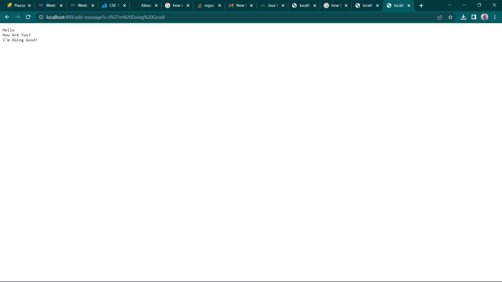
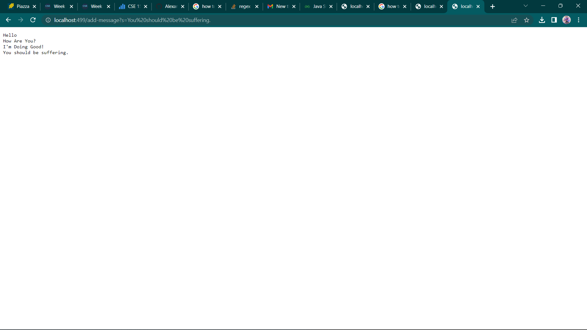

Week 3 Lab Report 2 "Servers and Bugs"
======================================
## Part 1

```
String str="";
    String[] res;

    public String handleRequest(URI url) {
        System.out.println("Path: " + url.getPath());
        if (url.getPath().contains("/add")) {
            String[] parameters= url.getQuery().split("=");
            if(parameters[0].equals("s")){
                str+= parameters[1]+"\n";
                return String.format("%s",str);
            }
            
        } 
            return "404 Not Found!";
        } 
```
To showcase the implementation, In the two images below, I added two strings too the URI in order to showcase it properly updating.


1. The methods that are called include handleRequest and path
2. The relevant arguments for handleRequest would be the /add arg and for the path method it would be the port number for the server
3. The string gets changed because I have it so the String will have multiple strings added onto it as the URI gets updated with more strings

## Part 2
I chose the bug in the testreversed method for lab 3.
1.Below is a test case in which the method fails
```
Test
  public void testreversed(){
    int[] input1= {1,2,3};
    assertArrayEquals(new int[]{3,2,1}, ArrayExamples.reversed(input1));
    }
 Method
 static int[] reversed(int[] arr) {
    int[] newArray = new int[arr.length];
    for(int i = 0; i < arr.length; i += 1) {
      arr[i] = arr[arr.length - i - 1];
    }
    return newArray;
  }
```
2. Below is a test case in which it succeeds
```
public void testReversed() {
    int[] input1 = { };
    assertArrayEquals(new int[]{ }, ArrayExamples.reversed(input1));
  }
```
3. The image below showcases the passed and failed JUNIT tests, the failed case appears to return empty.

4. The bug before and after the fix can be seen below:
```
arr[i] = arr[arr.length - i - 1];
```
```
newArray[i] = arr[arr.length - i - 1];
```
5. The fix addresses the issue because originally we were returning newArray without updating its contents were empty, but by having newArray get updated in the loop, we fix our problem

## Part 3
Something that I had learned in lab 2 was server making. I originally thought you had to always pay for a website to be up but seeing this implementation gets me excited to learn more.
It's also sort of frightening to think about the possible magnitude these server files could mount up to. I just hope I'm ready for what's to come!
