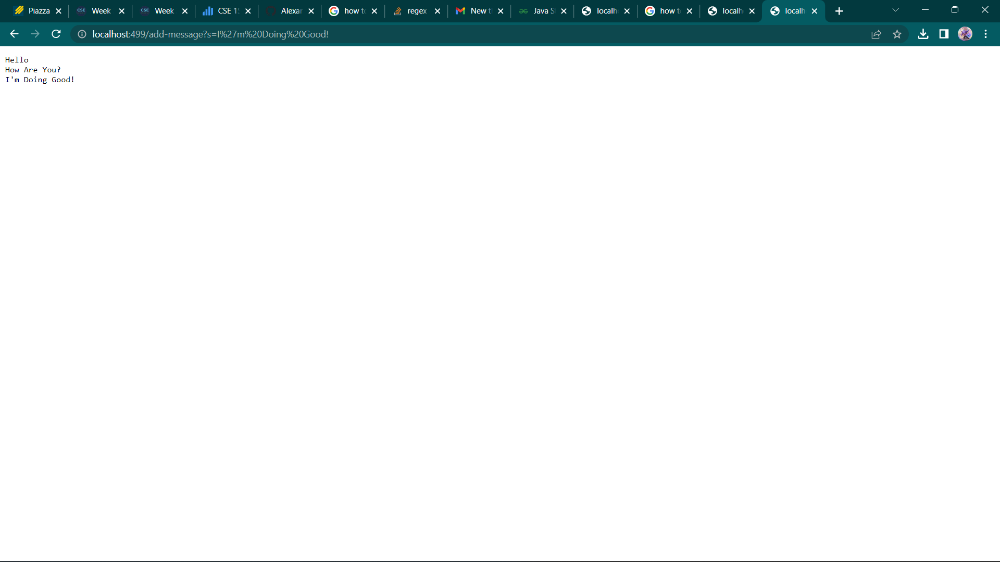
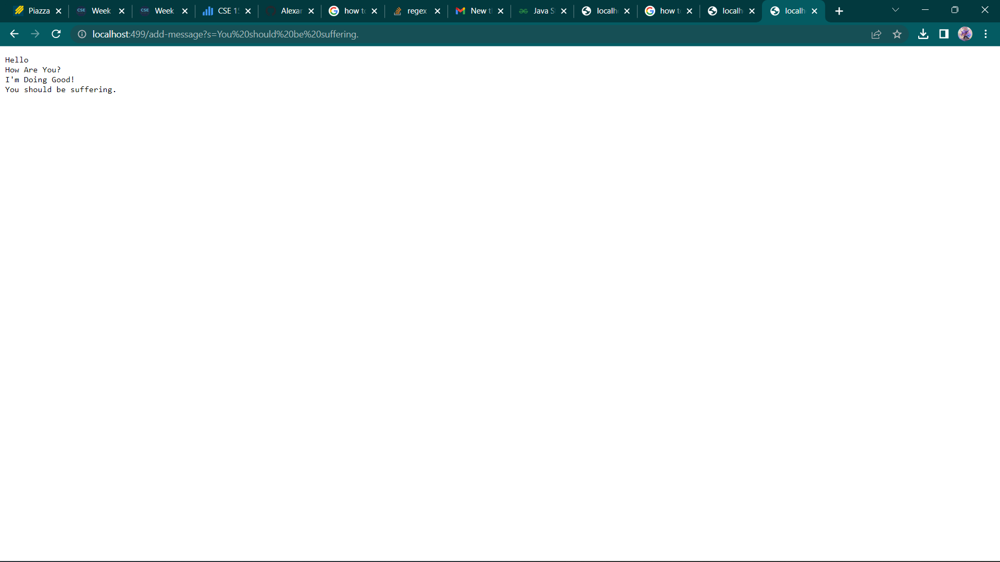
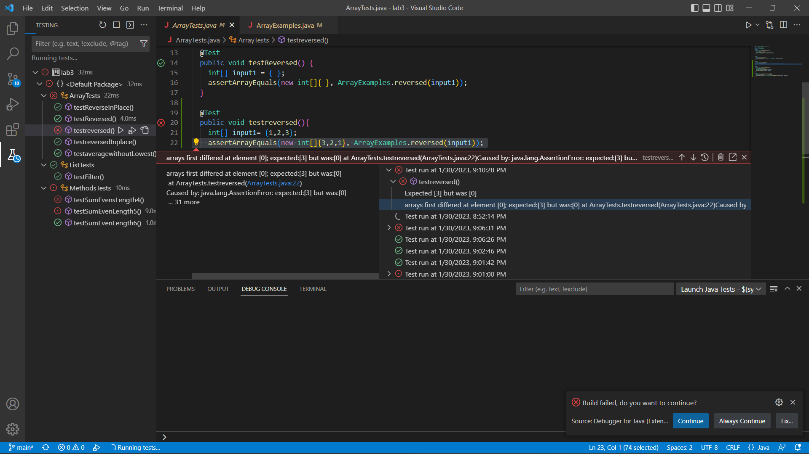

Week 3 Lab Report 2 "Servers and Bugs"
======================================
## Part 1

```
import java.io.IOException;
import java.net.URI;

class Handler implements URLHandler {
String str="";
    

    public String handleRequest(URI url) {
        System.out.println("Path: " + url.getPath());
        if (url.getPath().contains("/add-message")) {
            String[] parameters= url.getQuery().split("=");
            if(parameters[0].equals("s")){
                str+= parameters[1]+"\n";
                return String.format("%s",str);
            }
            
        } 
            return "404 Not Found!";
        }
}
class StringServer {
    public static void main(String[] args) throws IOException {
        if(args.length == 0){
            System.out.println("Missing port number! Try any number between 1024 to 49151");
            return;
        }

        int port = Integer.parseInt(args[0]);

        Server.start(port, new Handler());
    }
}
```
To showcase the implementation, In the two images below, I added two strings to the URI in order to showcase it properly updating.


1. The methods that are called include handleRequest, getPath, and getQuery
2. handleRequest specifically handles a URI url and based on wether or not it contains add-message, it will either update the string str with the new string message or return a 404 Not Found Message.
3. The relevant arguments for handleRequest would be the URI url and /add-message arg while the path method's arguments would be the port number for the server
4. The string gets changed because I have it so the String str will have multiple strings added onto it as the URI gets updated with more strings. For example, in the screenshots above I add two messages. The "I'm Doing Good" message is added to str with a new line so that way it prints out in the above format. str must be += to the query message otherwise, it won't save the previous messages. Then when I add the "You should be suffering", it will follow after the "I'm Doing Good!" message and not just create a new str.

## Part 2
I picked the bug in the testreversed method for lab 3 in the Array Methods section.
[Lab3 ArrayTest](https://ucsd-cse15l-w23.github.io/week/week3/#array-methods)

1.Below is a test case in which the input is an int array {1,2,3} with an expected output of {3,2,1}. the method fails
```
Test
  public void testreversed(){
    int[] input1= {1,2,3};
    assertArrayEquals(new int[]{3,2,1}, ArrayExamples.reversed(input1));
    }
 Method
 static int[] reversed(int[] arr) {
    int[] newArray = new int[arr.length];
    for(int i = 0; i < arr.length; i += 1) {
      arr[i] = arr[arr.length - i - 1];
    }
    return newArray;
  }
```
2. Below is a test case in which the input, an empty int array has an expected output of an empty int array, succeeds

```
public void testReversed() {
    int[] input1 = { };
    assertArrayEquals(new int[]{ }, ArrayExamples.reversed(input1));
  }
```
3. The image below showcases the passed and failed JUNIT tests, the failed case appears to return empty. This paticular output can give us a hint that we aren't properly updating our array's values within the method. With this hint, it can help us narrow our search for the bug in our code.

4. The bug before and after the fix can be seen below:
```
static int[] reversed(int[] arr) {
    int[] newArray = new int[arr.length];
    for(int i = 0; i < arr.length; i += 1) {
      arr[i] = arr[arr.length - i - 1];
    }
    return newArray;
  }
```
```
static int[] reversed(int[] arr) {
    int[] newArray = new int[arr.length];
    for(int i = 0; i < arr.length; i += 1) {
      newArray[i] = arr[arr.length - i - 1];
    }
    return newArray;
  }
```
5. The fix addresses the issue because originally we were returning newArray without updating its contents were empty, but by having newArray get updated in the loop, we fix our problem

## Part 3
Something that I had learned in lab 2 was server making. I originally thought you had to always pay for a website to be up but seeing this implementation gets me excited to learn more.
It's also sort of frightening to think about the possible magnitude these server files could mount up to. I just hope I'm ready for what's to come!
