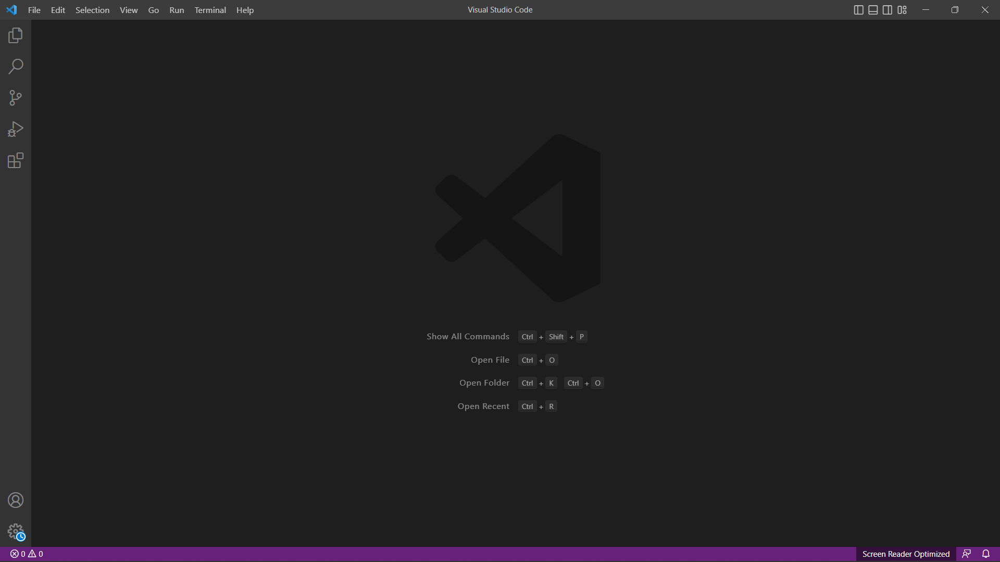

Week 1 Lab Tutorial!
====================
## Step 1 VS Code Installation
1. To begin, We need to first download VS Code from the website: [Link](https://code.visualstudio.com/)
2. Next, after following all the prompts you should then attempt to open VS Code
3. When opening VS code you should see something akin to this, my version may look different due to personal customizations!

## Step 2 Remotely Connecting
1. First you need to ensure you have the credentials needed for your CSE 15L password and username which can be found in : [Link](https://sdacs.ucsd.edu/~icc/index.php)
2. The site may prompt you to reset your password, click on it and follow through the process of resetting your password. Give it 15 minutes before moving on to the next step since you'll need to use your updated password to connect!
3. After retrieving the credentials, make sure you use the gitbash on VS Code to connect to that account, it may prompt you with a question about connecting, be sure to say yes!
4. This is what your result should look like:

## Step 3 Trying out some Commands
1. Try some of the following commands: cd, ls, pwd, mkdir, and cp in a few different ways to see what result you get
2. Be sure to note down what you get and compare to a lab partner!
3. Some of my testing can be seen in the image at the end of this step.

4. Notice something? If you look closely at the commands I had tried, you can see that I hadn't used my username when attempting to copy/print out the files. Don't forget to double check otherwise you'll end up fairly confused!
5. Are your results the same? Or different? Note them down!

## The End!
If there are any issues, be sure to refer back to the handout or ask one of the TAs for help!
