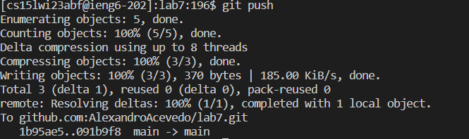

# Lab 4 Report

## ieng6 Login
In the screenshot below, you can see that I now don't have to sift through my ol' password sheet.
In the command line I had a key path of <s><s><tab>. 
  
Since there was really only one recent command that had started with "ss" I simply pressed tab to
auto complete!

## Cloning from my Git Repository
Git cloning was a sinch with the following key presses: <up><up><up><up><up><up><up><up><enter>
The command git clone was 8 up in the search history, so I used up arrow to access it.

## Failed Tests
With the failed test below, I compiled the test by utilizng <ctrl+r> <l><i><b> <up><up><enter>, <ctrl+r> <l><i><b> <up><up><enter>
I searched lib because both commands contain lib within. 
The javac -cp .:lib/hamcrest-core-
1.3.jar:lib/junit-4.13.2.jar *.java was less recent so I had gone up twice.
After executing that command, I did the same thing with the run command.
Take note of the failed output.

  
## Nano? More like Nanyes!
In order to edit the ListExamples.java file, I had ran the file through nano with the following keys
<ctrl+r><n><a><n><enter>
I figured since nano was really the only command that started with n, It'd be wise to search for it.
As for going to the line of code with the error in nano, since I remembered aproximately where it was,
I did <alt+g><43><enter>
This takes you to the line number you inputted.

  
## Passing Tests
After the changes, I did <up><up><enter> to run the TestListExamples.java file
I had to do less ups since I had executed the command more recently

## Add, Commit, and Push
With the test passed, I added,committed, and pushed to github. 
The following keybinds are in that respective order:
<ctrl+r><g><i><t><spacebar><a><enter>, <ctrl+r><g><i><t><spacebar><c><o><enter>, 
<ctrl+r><g><i><t><spacebar>
<enter>

I used ctrl+r for all of them since I would only have to do git + letter 
instead of trying to up arrow through my history and waste time.

## The End!
There are many ways to fully optomize how fast you can sift through your terminal history,

Below are some sources that I individually looked up during lab to further improve my time!

[Nano CheatSheet](https://www.nano-editor.org/dist/latest/cheatsheet.html)
[Handy Linux Shortcuts!](https://linuxhandbook.com/linux-shortcuts/)
