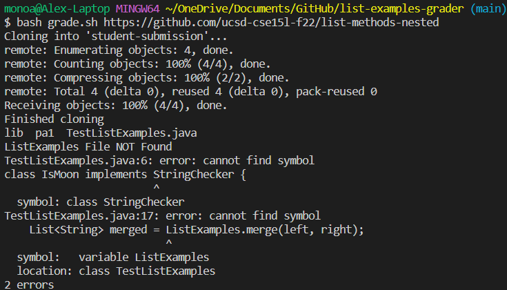
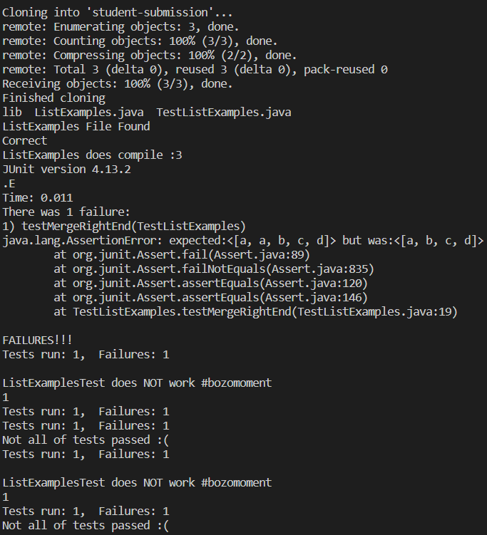
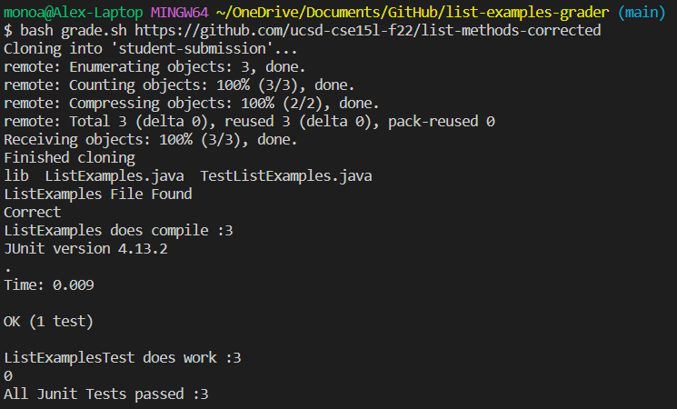

# Lab 5 Report "Looking back at Lab 6"
(I asked chatGPT for formatting advice)

In the screenshots below I showcase how my new grade report can detect and assert the correct presence of student submissions.

## What I changed

I learned that it was a lot easier to just copy the lib folder into the new student submission directory instead of manually adding the Junit files.
Furthermore a peer taught me about the 'if [[ $? -eq 0 ]]' as a better way to look for a success since before I had copied the compile result to a txt file and grepped for any failures.
Now, I can cut on run time by just determining if it was a success or failure!
In addition, I used `*.java` instead of compiling the files individually so that way I'd have a faster run time.
## What I want to learn more about

Since this is something similar to what TAs would do when setting up a course, I'd like to know how effecient the grading algorithim can get. Since mine mostly determines if its a pass, fail, or non-existent.
I'd like to know how to calculate an average score of the total failure compared to the total tests, I had tried grepping the 'failures' line and cutting off after `:` but I had no luck.
To me, it's very important to learn how bash scripts work and improve my navigation skills so I enhance my productivity and efficiency when working with Linux and Unix-based systems. 
I want to further familiarize myself with not only the basic structure of bash scripts and it's commonly used commands and shortcuts, but I also want to be able to get to a level where I can create bash scripts on an more advanced level.
